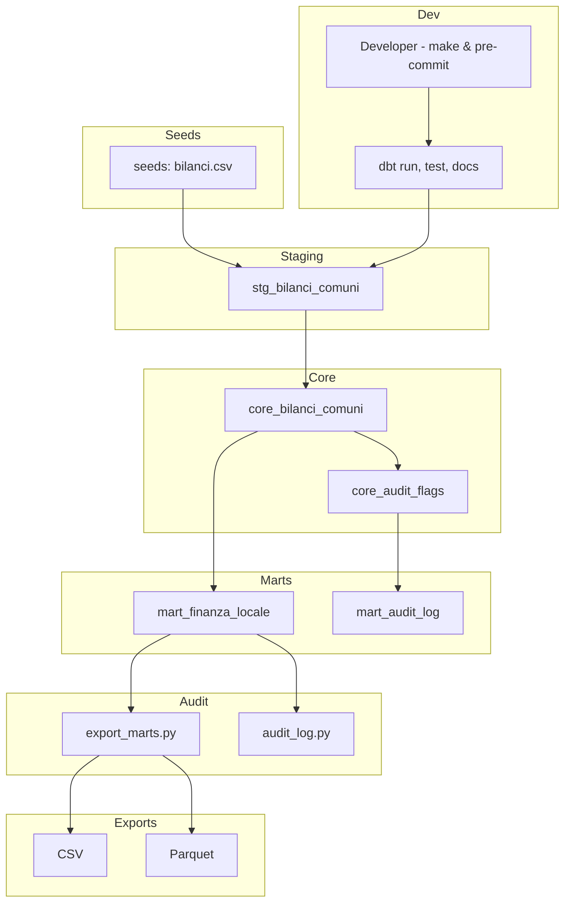

# 🧊 Mini Lakehouse Didattico

> 📊 **Data Lakehouse minimale in locale** per progetti educativi e prototipazione rapida.  
> 🎯 Focus su **modellazione a livelli**, **validazione automatica** e **audit trasparente** con `dbt + DuckDB`.


[](https://andreabozzo.github.io/Mini-Lakehouse-Didattico/)

---

## 🧭 Table of Contents
- [⚙️ Stack](#️-stack)
- [🎯 Obiettivi](#-obiettivi)
- [📦 Dataset iniziale](#-dataset-iniziale)
- [🏗️ Architettura](#-architettura)
- [🧪 Esecuzione base](#-esecuzione-base)
- [🛠️ Comandi Makefile](#-comandi-makefile)
- [📁 Struttura progetto](#-struttura-progetto)
- [📄 Licenza](#-licenza)
- [🙋‍♂️ Contatti](#-contatti)

---

## ⚙️ Stack

| Tecnologia | Descrizione |
|------------|-------------|
| [DuckDB](https://duckdb.org/) | Motore SQL OLAP embedded |
| [dbt-core](https://docs.getdbt.com/) | Modellazione e orchestrazione SQL |
| [`dbt-utils`](https://hub.getdbt.com/dbt-labs/dbt_utils/) | Macro standard |
| [`dbt-date`](https://hub.getdbt.com/godatadriven/dbt_date/) | Macro temporali |
| [Typer](https://typer.tiangolo.com/) + [Rich](https://rich.readthedocs.io/) | CLI interattiva avanzata |
| [Ruff](https://docs.astral.sh/ruff/) | Linter e formatter veloce |
| [Poetry](https://python-poetry.org/) | Gestione pacchetti Python |

---

## 🎯 Obiettivi

- Pipeline trasparente, riproducibile e validabile
- Modellazione a 3 livelli: `staging → core → marts`
- Validazioni automatiche + audit semplificato
- Base flessibile per dataset pubblici italiani (ISTAT, SIOPE, OpenCUP...)
- Supporto a esportazioni intelligenti da `marts/`
- CLI `pipeline.py` per uso locale o CI

---

## 📦 Dataset iniziale

- Dati simulati ispirati a bilanci comunali italiani
- Input: file `.csv` in `seeds/main/`
- Colonne chiave: codice comune, voce, importo, anno

---

## 🏗️ Architettura

<!-- AUTO-SECTION:DIAGRAM -->

<!-- END-SECTION:DIAGRAM -->

```
📊 Descrizione del diagramma

Il diagramma mostra il flusso di dati e processi all'interno del progetto dbt.
Rappresenta i livelli di modellazione (staging, core, marts), i processi di audit, i dati di input (seeds), le esportazioni (CSV, Parquet) e le attività di sviluppo (CLI, make, pre-commit).

Le frecce indicano la dipendenza e il flusso dati tra componenti.
I blocchi logici (subgraph) raggruppano le fasi principali del ciclo di vita del dato.
Questo schema facilita la comprensione dell’architettura complessiva da parte di sviluppatori e stakeholder.
```

---

## 🧪 Esecuzione base

```bash
make install
make build
make check
make export-marts
make audit-log
```

Oppure via CLI:

```bash
poetry run python cli/pipeline.py
```

---

## 🛠️ Comandi Makefile

| Comando         | Descrizione |
|----------------|-------------|
| `make install` | Installa tutto con Poetry |
| `make build`   | dbt deps + seed + run + test |
| `make check`   | Lint e format con Ruff |
| `make export-marts` | Esporta output intelligenti |
| `make audit-log` | Log controlli qualità |
| `make coverage` | Genera report copertura |
| `make all`     | Build + export + check |
| `make ci`      | Pipeline per CI |
| `make clean`   | Pulisce cache e target |

---

## 📁 Struttura progetto

```bash
mini-lakehouse/
├── audit/                  # Script esterni dbt (es. export_marts.py)
├── cli/                    # CLI pipeline interattiva con Typer
├── dbt/                    # Progetto dbt completo
├── models/                 # staging → core → marts
├── seeds/main/            # CSV seed di input
├── reports/               # coverage, log, audit
├── tests/                 # pytest + test CLI + coverage
├── Makefile
├── pyproject.toml
└── README.md
```

---

## 📄 Licenza

Distribuito sotto licenza MIT.

---

## 🙋‍♂️ Contatti

Andrea Bozzo  
📧 andreabozzo92@gmail.com  
[🔗 GitHub](https://github.com/AndreaBozzo)
